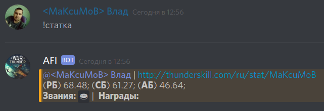
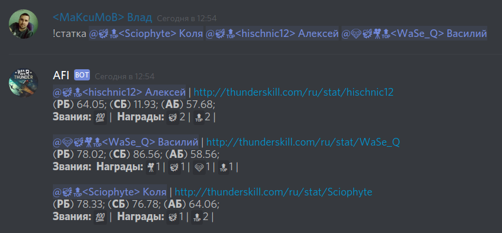
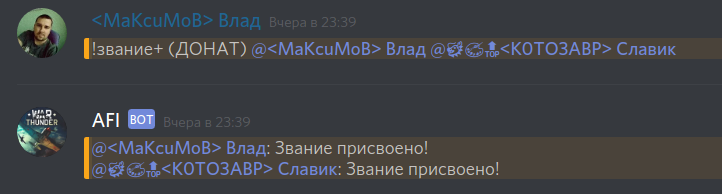
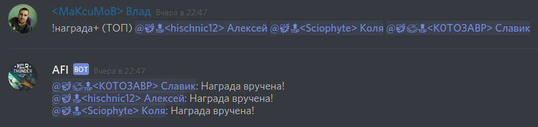
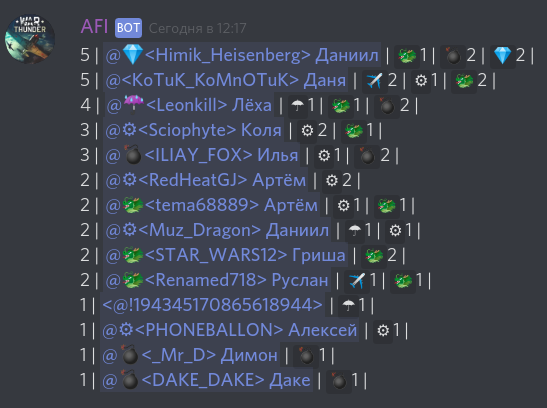

# AFI - Discord-бот, который любит WarThunder

[Русский](README.md) |
[English](README_en.md)

- [0. ОБЩАЯ ИНФОРМАЦИЯ](#0-ОБЩАЯ-ИНФОРМАЦИЯ)
- [1. РОЛИ И ПРАВА](#1-РОЛИ-И-ПРАВА)
- [2. ТРЕБОВАНИЯ К НИКАМ](#2-ТРЕБОВАНИЯ-К-НИКАМ)
- [3. ЧТО УМЕЕТ AFI](#3-ЧТО-УМЕЕТ-afi)
    - [3.1. Вывод статистики](#31-Вывод-статистики)
    - [3.2. Звания и Награды](#32-Звания-и-Награды)
        - [3.2.1. Создание звания](#321-Создание-звания)
        - [3.2.2. Удаление звания](#322-Удаление-звания)
        - [3.2.3. Изменить звание](#323-Изменить-звание)
        - [3.2.4. Присвоение звания и разжалование](#324-Присвоение-звания-и-разжалование)
        - [3.2.5. Создание награды](#325-Создание-награды)
        - [3.2.6. Удаление награды](#326-Удаление-награды)
        - [3.2.7. Изменение награды](#327-Изменение-награды)
        - [3.2.8. Вручение и возврат наград](#328-Вручение-и-возврат-наград)
        - [3.2.9. Рейтинг игроков](#329-Рейтинг-игроков)
- [4. УСТАНОВКА БОТА НА СВОЙ СЕРВЕР](#4-УСТАНОВКА-БОТА-НА-СВОЙ-СЕРВЕР)

## 0. ОБЩАЯ ИНФОРМАЦИЯ

Если у вас есть сервер Discord, то пригласить бота к себе на сервер можно по следующей ссылке:
[Бот AFI](https://discordapp.com/oauth2/authorize?client_id=304296578989162496&scope=bot&permissions=134728768)

[Discord-канал тех. поддержки](https://discord.gg/Gqza8FD)  
[Собираем на развитие](https://yasobe.ru/na/afi)

## 1. РОЛИ И ПРАВА

После приглашения бота на свой сервер, он автоматически получит следующие права:

- управление никнеймами (обязательно)
- чтение сообщений (обязательно)
- встраивание ссылок (на всякий случай)
- просмотр истории сообщений  (на всякий случай)
- использование внешних эмодзи (на всякий случай)
- отправка сообщений (обязательно)
- прикрепление файлов (на всякий случай)
- упоминание @everyone (на всякий случай)
- добавление реакций (на всякий случай)
- просмотр голосовых каналов (связано со 2-м)

В любом случае не забывайте проверять, что у бота есть право читать писать в тот чат, в который вы посылаете ему команду.

Дополнительно в настройках сервера необходимо:

1. Создать роль с названием "[AFI] Звания и награды"
2. Перетащить роль **AFI** на самый верх;

## 2. ТРЕБОВАНИЯ К НИКАМ

Для того, чтобы AFI нашёл статистику игрока, должно быть выполнено одно из условий:

1. Псевдоним на сервере Discord включает игровой ник, обрамлённый треугольными скобками. Например, если в игре ник `pupkin`, то псевдоним в дискорде должен быть `<pupkin>`, `<pupkin> (Василий)`, `[AFI]<pupkin>(Василий)` и т.д.
2. Игрок привязал свой игровой ник к учётной записи Discord командой `!ник (мой_игровой_ник)`.

Без этого не будет отдаваться игровая статистика с ThunderSkill.

## 3. ЧТО УМЕЕТ AFI

### 3.1. Вывод статистики

Для просмотра своей игровой статистики с ThunderSkill нужно отправить в любой текстовый канал, куда у бота есть доступ, команду `!статка`. Если ваш псевдоним соответствуем пункту 2, то AFI получит вашу статистику на ThunderSkill и вернёт её обратно в чат.



Также можно запросить статистику одного или нескольких участников полкового дискорд-сервера упомянув их после команды `!статка`, например: 



В статистику включаются Звания и Награды, выданные игрокам в полку.

### 3.2. Звания и Награды

Если в полку действует система награждений за определённые достижения, AFI поможет вести учёт таких Званий и Наград.

**Звание** - присваивается игроку бессрочно за определённые достижения. Например, в нашем полку при достижении 100-го уровня игроку присваивается звание `💯` - **МАРШАЛ**,  за суммарный донат в игру свыше 10 000 р присваивается звание `🍩` - **ДОНАТ**. Звание не является каким либо поощрением, а лишь говорит об определённых качествах и достижениях игрока.

**Награда** - вручается игрокам за выполнение определённых заданий, при этом значёк награды закрепляется на определённое время перед ником игрока. Например, за 5 фрагов в полковом сражении у нас вручают награду `🐲` - **ДРАКОН**, за 7 фрагов вручают `⛧` - **САТАНА** и 500 голды, а за самый красивый фраг у нас полагается награда `🎨` - **ХУДОЖНИК**.

Управлять званиями и наградами могут только игроки с ролью "[AFI] Звания и награды".

При вручении награды бот автоматически добавляет значёк к нику игрока. Таким образом у активных игроков ники постоянно содержат знаки отличия и могут выглядеть приблизительно так: `💎☔<As_Ha_Bblcote> Димас` | `🐲🔝<hischnic12> Алексей` | `💎🐲🎥🔝<WaSe_Q> Василий`.

Следует помнить, что названия и значки званий/наград не должны повторяться.

Посмотреть список званий и наград полка можно командой `!звания` и `!награды` соответственно.

#### 3.2.1. Создание звания

Чтобы добавить новое звание в базу данных полка нужно ввести команду следующего вида:

`!добавить-звание-в-базу-данных [значёк] (название) <описание>`

Например:

`!добавить-звание-в-базу-данных [💯] (МАРШАЛ) <получают игроки с сотым уровнем в игре>`

После этого звание сохранится в базе данных полка и его можно будет присваивать игрокам.

#### 3.2.2. Удаление звания

Чтобы удалить новое звание из базы данных полка нужно ввести команду следующего вида:

`!удалить-звание-из-базы-данных (название)`

#### 3.2.3. Изменить звание

Для изменения звания нужно дать команду:

`!изменить-звание [значёк] (название) <описание>`

Изменится то звание, которое совпадёт по названию.

#### 3.2.4. Присвоение звания и разжалование

Для присвоения звания нужно отправить в чат сообщение с командой:

`!звание+ (название) @игрок1 @игрок2 @игрок3 и т.д.`

Например:



Присвоить игроку одно и то же звание дважды не получится.

Разжалование в звании выполняется такой же командой, только со знаком `-`:

`!звание- (название) @игрок1 @игрок2 @игрок3 и т.д.`

#### 3.2.5. Создание награды

Создание награды будет выполняться командой:

`!добавить-награду-в-базу-данных [значёк] (название) <описание> {порядковый номер}`

Например:

`!добавить-награду-в-базу-данных [☔️] (ПВО) <забрать 3 воздуха с наземки> {4}`

После этого награда сохранится в базе данных полка и её можно будет вручать игрокам.

#### 3.2.6. Удаление награды

Удаление награды из базы данных:

`!удалить-награду-из-базы-данных (название)`

при удалении награды все записи о её присвоении игрокам также удалятся.

#### 3.2.7. Изменение награды

Для изменения награды нужно дать боту команду:

`!изменить-награду [значёк] (название) <описание> {порядковый номер}`

Изменится та награда, которая совпадёт по названию.

#### 3.2.8. Вручение и возврат наград

Для вручения награды нужно отправить в чат сообщение с командой:

`!награда+ (название) @игрок1 @игрок2 @игрок3 и т.д.`

Например:



Вручить игроку одну и ту же награду можно бесконечное кол-во раз. Кол-во раз получения игроком награды указывается числом рядом со значком награды в статистике.

Возврат награды выполняется такой же командой, только со знаком `-`:

`!награда- (название) @игрок1 @игрок2 @игрок3 и т.д.`

При этом будет удаляться последняя из присвоенных наград.

#### 3.2.9. Рейтинг игроков

Чтобы составить рейтинг игроков по кол-ву полученных наград за определённый период, нужно дать
боту команду:

`!топ (ГГГГ-ММ-ДД) [ГГГГ-ММ-ДД]`

в круглых скобках - начальная дата, а в квадратных - конечная. Если команда дана неверно - бот даст подсказку.

Выглядит рейтинг приблизительно так:



## 4. УСТАНОВКА БОТА НА СВОЙ СЕРВЕР

Бот работает через [discord.py](https://github.com/Rapptz/discord.py). Общение бота с базой данных происходит при помощи Django.

Сразу оговорюсь, что реализация связки хромает, но это будет поправлено в будущем.

Установка **Discord.py**:

```
git clone git@github.com:maksymov/afi.git
sudo apt install virtualenv
cd afi/
source .env/bin/activate
pip install -U discord.py
sudo apt install git
pip install --upgrade pip
pip install django
python manage.py migrate
```

После этого клонируйте репозиторий AFI, и добавте файл bot_settings.py

```
# -*- coding: utf-8 -*-

BOT_TOKEN = 'здесь-вписать-токен-бота'
DJANGO_URL = 'http://127.0.0.1:8000' # или что там у вас...
```

Переходим в корень проекта и запускаем бота:

`python3 discord_bot.py &`

Описывать боевую настройку Django здесь не буду.
