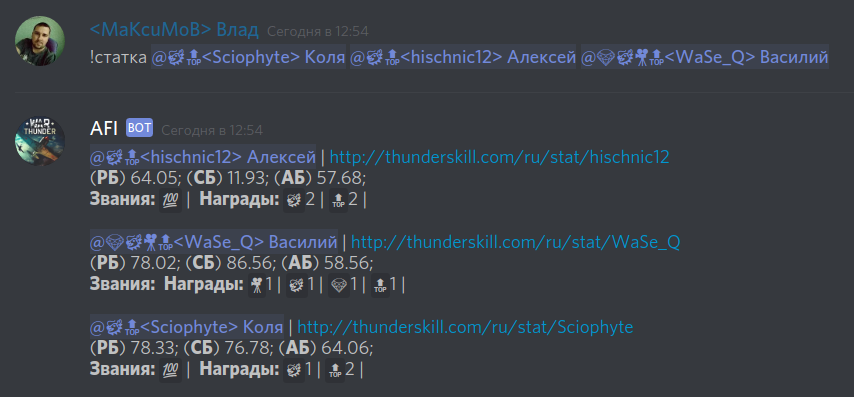

# AFI - Discord-bot that loves WarThunder

[Русский](README.md) |
[English](README_en.md)

## 0. GENERAL INFORMATION

If you have a Discord server, then you can invite the bot to your server via the following link:
[AFI](https://discordapp.com/oauth2/authorize?client_id=304296578989162496&scope=bot&permissions=134728768)

[AFI Support](https://discord.gg/Gqza8FD)

## 1. ROLES AND RIGHTS

After inviting the bot to your server, it will automatically receive the following rights:

- nickname management (required)
- reading messages (required)
- Embedding links (just in case)
- viewing the history of messages (just in case)
- use of external emoji (just in case)
- sending messages (required)
- Attaching files (just in case)
- mentioning @everyone (just in case)
- adding reactions (just in case)
- viewing of voice channels (linked to the 2nd)

In any case, do not forget to check that the bot has the right to read to write to the chat room to which you send it a command.

Additionally, in the server settings you need:

1. Create a role with the title "[AFI] Ranks and awards"
2. Drag the **AFI** role to the very top;

## 2. REQUIREMENTS TO NIKCNAMES

In order for AFI to find player statistics, one of the following conditions must be met:

1. Nickname on Discord server must include War Thunder username surrounded by triangular brackets. For example, if the War Thunder username is `smith`, then Discord nickname must be` <smith> `,` <smith> (Will) `,` [AFI] <smith> (Will) `, etc.
2. The player linked his War Thunder username to the Discord account by command `!nick (my_WT_username)`.

Without this, game statistics with ThunderSkill will not be given.

## 3. WHAT AFI CAN DO

### 3.1. Show statistic

To view your game statistics with ThunderSkill you need to send the command `!stat` to any text channel where the bot has access, . If your nickname corresponds to item 2, then AFI will get your statistics on ThunderSkill and return it back to the chat.

You can also can get the statistics of one or several participants of the discord server by mentioning them after the command `!stat`, for example:

The statistics include ranks and awards given to players in the squad.

